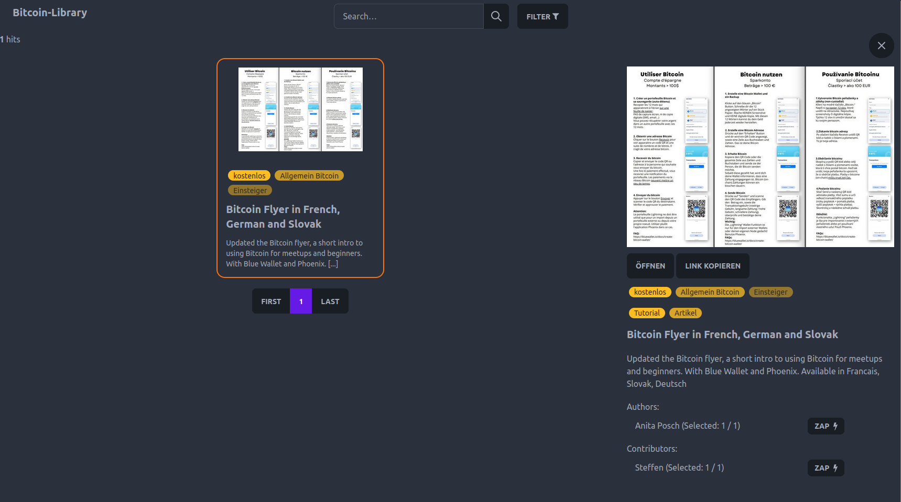

# Bitcoin Library Frontend

This is the frontend for the Bitcoin-Library project.
the idea is to establish a community driven library of bitcoin related content based on the [Nostr protocol](https://nostr.com/).

Together with the [Bitcoin Library Browser Extension](https://github.com/bitcoin-library/browser-extension) people can easily add content to the library in form of Nostr events.
These events get parsed by a note fetcher and are then send to the backend to make them available for search.

Since everything is based on Nostr and sent to relays also other services could easily make use of the data.



## Metadata Scheme of Notes

The metadata of the resources is stored as an `tag` in the Nostr event.

...TODO describe the metadata scheme...

## Usage

Copy the `.env.example` file to `.env` and fill in the values.

```bash
cp .env.example .env
```

Install the dependencies

```bash
npm install
```


## Development

Start the development server

```bash
npm run dev
```

## Tasks

- [ ] Completely remove elastic and mongo stuff and fully switch to meilisearch
